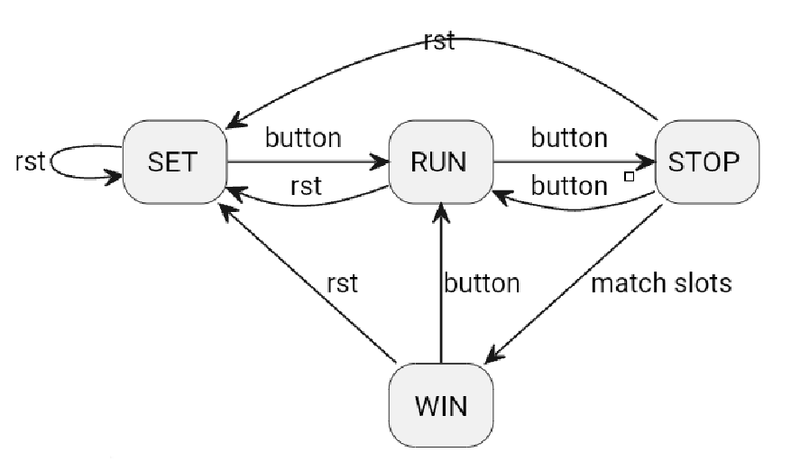
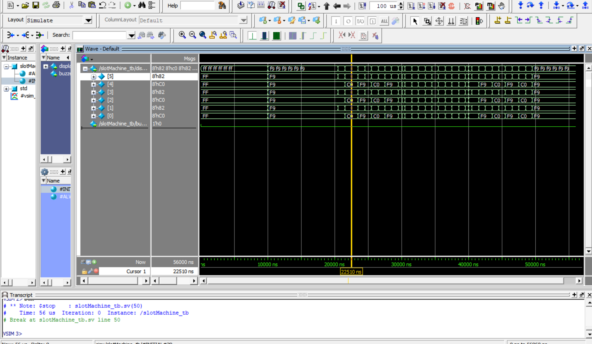

# Slot Machine Game on FPGA

This project implements a **slot machine game** on an Altera FPGA using **SystemVerilog**, utilizing **clock dividers**, **shift registers**, and **finite state machines (FSMs)**. The system features interactive gameplay, responsive state transitions, and a visual output using a **seven-segment display**.

The goal is to design and verify a functional slot machine game capable of displaying random numbers, detecting wins, and providing visual/auditory feedback based on the game's outcome.

## Features
- **Random Number Generation**:
  - Utilizes clock dividers and shift registers to generate pseudo-random numbers, mimicking the spinning reels of a traditional slot machine.
- **Finite State Machine**:
  - Tracks four distinct states:
    1. **SET**: Initializes slot values and resets the system.
    2. **RUN**: Spins the slots at different speeds when the start/stop button is pressed.
    3. **STOP**: Stops the slot reels and blinks the results.
    4. **WIN**: Activates the buzzer and changes the blink rate if all slots match.
  - A button on the FPGA toggles between states, enabling interactive controls.

### Key Features
- **Clock Divider**: Generates slower clock signals from the FPGA's 50 MHz clock for synchronized operations.
- **Finite State Machine (FSM)**: Controls the game states (`SET`, `RUN`, `STOP`, `WIN`) and transitions.
- **Shift Registers**: Implements pseudo-random number generation for slot results.
- **Seven-Segment Display**: Displays slot outcomes in real time.
- **Buzzer Feedback**: Signals win conditions with an audible tone.

## Technical Highlights

### Core Modules
1. **Clock Divider**: Produces reduced clock speeds from the FPGA's 50 MHz clock for various game components. 
2. **Slot Module**: Generates random numbers using linear feedback shift registers (LFSRs).
3. **Finite State Machine (FSM)**: Controls the game states, transitions, and outputs.
4. **Seven-Segment Display Driver**: Converts binary outputs into human-readable numbers.

### Verification
Before implementing on the FPGA, each core module had to be incrementally tested using QuestaSim to ensure full functionality. To accomplish this, I created testbenches for each core module, simulating every possible scenario a module might encounter. After verifying all modules were functional, I created a top module to connect everything and ran a final simulation to test the slot machine's functionality as a whole (slotMachine_tb). 

### Tools Used
- Quartus
- QuestaSim
- Altera FPGA
- Buzzer

## Results
- **Interactive Gameplay**: Real-time slot results displayed on the FPGA.
- **Reliable State Transitions**: FSM ensures seamless state changes.
- **High Responsiveness**: Low-latency input processing and visual updates.
